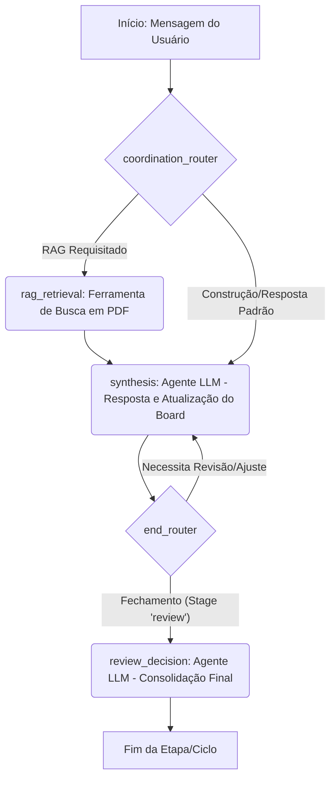

# Sistema Colaborativo com LangGraph, RAG e Streamlit

| Nome | NUSP |
| -------- | ----- |
| Eduardo Neves Gomes da Silva | 13822710 |
| Isabela Beatriz Sousa Nunes Farias | 13823833|
| Jhonathan Oliveira Alves | 11838116 |
| João Pedro Boiago Gomes Santana | 14747211 |

# Descrição do Trabalho
## Objetivo

Desenvolver um sistema colaborativo baseado em Recuperação de Informação Aumentada por Geração (RAG), utilizando LangGraph e Streamlit, que simule um ambiente de trabalho em grupo, considerando os princípios do modelo 3C: Comunicação, Colaboração e Coordenação.

## Entregáveis

1. **Repositório Git aberto** com o código-fonte do projeto.
2. **Documentação** detalhada do projeto, pode ser em Markdown no próprio repositório:
   - Descrição do cenário colaborativo escolhido.
   - Diagrama do grafo do LangGraph utilizado.
   - Explicação de como o sistema aborda cada um dos 3C.
   - Instruções de execução do sistema.
3. **Aplicação funcional** (preferencialmente via Streamlit), permitindo a interação simulada de múltiplos usuários sobre até 5 documentos PDF.

## Requisitos Mínimos

- Utilizar LangGraph para modelar o fluxo de interação entre usuários e o agente LLM.
- Implementar pelo menos um nó de ferramenta (ex: busca em PDF, sumarização, votação, etc.).
- Permitir que múltiplos usuários interajam e que suas ações sejam registradas e atribuídas.
- O sistema deve contemplar:
  - **Comunicação:** Troca de mensagens entre usuários e agente.
  - **Colaboração:** Construção coletiva de respostas, decisões ou documentos.
  - **Coordenação:** Gerenciamento do fluxo, atribuição de tarefas ou controle de etapas do processo.
- Diagrama do grafo do LangGraph, mostrando os nós, arestas e loops do sistema.
- Interface via Streamlit para facilitar a interação.

## Orientações

1. Modelar o grafo do LangGraph, detalhando os nós (ex: entrada de mensagem, busca, síntese, decisão, revisão).
2. Implementar o sistema, integrando LangGraph, LLM e Streamlit.
3. Documentar o projeto, incluindo o diagrama do grafo e explicações sobre o funcionamento.
4. Publicar o código em um repositório Git aberto e incluam um README com instruções de uso.

## Avaliação
- Clareza e criatividade na modelagem do sistema colaborativo.
- Funcionamento correto da aplicação.
- Qualidade da documentação e do diagrama do grafo.
- Uso adequado dos conceitos de Comunicação, Colaboração e Coordenação.

# Relatório

# Sistema Colaborativo de Organização de Eventos (Projeto 3C)

Este projeto implementa um sistema colaborativo baseado em **Recuperação de Informação Aumentada por Geração (RAG)** e orquestrado por **LangGraph**.  
Ele simula uma equipe de discentes organizando uma semana acadêmica, incorporando os princípios do modelo **3C: Comunicação, Colaboração e Coordenação**.

---

## 1. Cenário Colaborativo Escolhido

### Contexto
Um grupo de organizadores está planejando uma **Semana Acadêmica**.

### Objetivo do Sistema
Servir como assistente inteligente e plataforma centralizada para:
- Discussão entre participantes  
- Consulta a documentos de apoio (regulamentos, orçamentos, cronogramas-modelo)  
- Construção colaborativa de um **Plano de Evento** final

Os PDFs carregados pelo usuário constituem a base de conhecimento utilizada pelo RAG.

---

## 2. Diagrama do Grafo do LangGraph

O LangGraph define o fluxo de trabalho do agente, onde o estado é compartilhado por todos os usuários (simulando colaboração em tempo real via Firestore).

### Estado do Grafo (AgentState)

| Campo     | Tipo              | Descrição |
|-----------|-------------------|-----------|
| messages  | List[BaseMessage] | Histórico da conversa (Comunicação) |
| board     | str               | Plano do Evento sendo construído (Colaboração) |
| stage     | Literal           | Fase do projeto: *brainstorm*, *research*, *draft*, *review* (Coordenação) |
| user_id   | str               | Usuário que gerou a ação atual |
| context   | str               | Contexto RAG recuperado |

---

### Nós e Arestas

#### Ações (Nós)

| Nó (Action) | Função |
|-------------|--------|
| **rag_retrieval** | Busca informações relevantes nos PDFs (RAG) |
| **synthesis** | Gera respostas, atualiza o board e sugere próximos passos |
| **review_decision** | Consolida o plano final ou sugere ajustes |

---

### Roteador (Coordination)

#### coordination_router — Transições
1. **rag_retrieval**  
   - Se *stage* for `research`, ou  
   - Se a mensagem contiver palavras-chave: “regulamento”, “orçamento”, “documento”, “PDF”.
2. **synthesis**  
   - Em qualquer outro caso.

#### end_router — Transições
1. **review_decision**  
   - Se *stage* for `review` **e** o plano estiver pronto.
2. **synthesis**  
   - Caso sejam necessários ajustes.

---

### Fluxo Principal (Grafo)



---

## 3. Abordagem dos Princípios 3C

O sistema foi arquitetado explicitamente para recuperar e manter o equilíbrio entre comunicação, colaboração e coordenação. Abaixo, detalhes práticos de implementação e exemplos de uso.

### Comunicação
- **Chat Multiusuário**  
  - Interface: Streamlit com uma área de chat multiusuário.  
  - Cada mensagem tem `user_id` e `timestamp`.  
  - Mensagens curtas ou longas podem desencadear diferentes rotas (ex.: perguntas objetivas → RAG; discussões abertas → synthesis).
- **Agente Conversacional (synthesis)**  
  - Mantém e usa `messages` como contexto para resposta e para justificar alterações no `board`.  
  - Gera resumos, sugestões e lembretes automáticos.
- **Transparência**  
  - O histórico completo e o estado do `board` ficam visíveis para todos (audit trail).  
  - Logs de alterações: quem alterou o board, quando e qual foi a alteração.

### Colaboração
- **Plano de Evento Compartilhado (`board`)**  
  - Formato: texto estruturado (markdown) armazenado no Firestore.  
  - Atualizações por patches: o agente aplica diffs/patches para reduzir conflitos.
- **Contribuição Coletiva**  
  - Qualquer usuário pode enviar conteúdo que leve a modificações no `board`.  
  - Mecanismo de "propostas" (opcional): users podem sugerir alterações que precisam ser aprovadas durante `review`.
- **Resolução de Conflitos**  
  - Estratégia: última alteração ganha (last-write-wins) por padrão; alternativa: controle de versões e merge manual durante `review`.

### Coordenação
- **Gerenciamento de Fluxo (`stage`)**  
  - Fases predefinidas: `brainstorm` → `research` → `draft` → `review`.  
  - Transições podem ser manuais (usuário muda o stage) ou automáticas (por regras definidas).
- **Roteamento Inteligente (coordination_router)**  
  - Analisa `stage` + conteúdo textual para decidir entre `rag_retrieval` e `synthesis`.  
  - Ex.: "Existe limite orçamentário para brindes?" + stage=`research` → `rag_retrieval`.
- **Atribuição de Ação (`user_id`)**  
  - Todas as ações ficam atreladas a um `user_id` para responsabilidade e follow-up.  
  - Possibilidade de criar tarefas/tickets a partir de mensagens para atribuição e acompanhamento.

---

## 4. Instruções de Execução do Sistema (Detalhadas)

### Pré-requisitos
- **Python 3.10+**
- **Streamlit** (requerido para UI)
- **Firestore** (para persistência do estado e do board)
- **Chave da API do Gemini** (a integração usa a API do Google Gemini)
  - Recomenda-se injetar a chave via variáveis de ambiente no ambiente Canvas: `apiKey = ""` no código, com a chave fornecida pelo ambiente.

---

### Configuração e Instalação

1. Crie e ative um ambiente Python:
```bash
python -m venv .venv
source .venv/bin/activate    # Linux / macOS
.venv\Scripts\activate       # Windows (CMD/Powershell)
```

2. Instale dependências (supondo `requirements.txt` disponível):
```bash
pip install -r requirements.txt
```

3. Arquivos principais sugeridos:
- `app.py` — aplicação Streamlit.
- `langgraph_workflow.py` — definição do grafo (nós, roteadores e estado).
- `rag/indexer.py` — indexação e consulta dos PDFs.
- `firestore_client.py` — helpers para persistência do AgentState.
- `utils/patcher.py` — aplicar diffs no `board`.

4. Exemplo mínimo de `requirements.txt`:
```
streamlit
langgraph
google-cloud-firestore
pandas
pdfplumber
faiss-cpu
openai  # ou cliente para Gemini conforme integração
```

---

### Execução

1. Defina variáveis de ambiente (exemplo Unix):
```bash
export GEMINI_API_KEY="sua_chave_aqui"
export GOOGLE_APPLICATION_CREDENTIALS="/caminho/para/credenciais.json"
```

2. Inicie a aplicação:
```bash
streamlit run app.py
```

3. Abra a URL mostrada no terminal (geralmente `http://localhost:8501`).

---

### Fluxo de Uso (Passo a Passo e Exemplos)

1. **Login**  
   - Na sidebar, digite o nome do colaborador (será usado como `user_id`).  

2. **Upload de PDFs**  
   - Envie até 5 PDFs com regulamentos, orçamentos e cronogramas.  
   - O sistema executa indexação RAG para consulta.

3. **Brainstorm**
   - Ex.: “Vamos focar em IA e sustentabilidade.”  
   - Stage: `brainstorm`. O agent registra ideias no `board` sem buscar RAG.

4. **Research (RAG)**
   - Mude para `research` ou pergunte diretamente.  
   - Ex.: “O orçamento da gráfica do ano passado permite 500 folders?”  
   - O roteador detecta a necessidade de `rag_retrieval`, busca trechos relevantes dos PDFs e anexa ao `context`.

5. **Draft**
   - Solicite ao agente consolidar:  
     - Ex.: “Agente, atualize o plano com um cronograma preliminar.”  
   - O agente usa `messages` + `context` para gerar o draft e atualiza `board`.

6. **Review**
   - Mude o `stage` para `review`.  
   - Solicite: “Gerar versão final / consolidar.”  
   - O agente executa `review_decision` — consolida e gera versão final (versão para exportação, PDF/markdown).

---

### Persistência e Exportação
- O `board` fica armazenado no Firestore como markdown.  
- Funcionalidade de exportação: gerar arquivos `.md` ou `.pdf` a partir do `board`.  
- Histórico e logs permitem reverter para versões anteriores.

---

## 5. Exemplo de Interações (Cenários Rápidos)

1. Usuário A (brainstorm): “Propostas de palestrantes sobre IA.”  
   - Agent responde com lista de tópicos e cria seção no `board`.

2. Usuário B (research): “Há restrições no regulamento sobre divulgação institucional?”  
   - Roteador chama `rag_retrieval`, retorna trechos do PDF e anexa ao `context` para o agent.

3. Usuário C (draft): “Agente, monte cronograma de 3 dias com horários.”  
   - Agent gera cronograma e atualiza `board`. Usuários revisam.

4. Usuário D (review): “Consolide e gere versão final em markdown.”  
   - `review_decision` é acionado; versão final é salva e exportada.

---

## 6. Observações Finais

- O projeto foca em tornar colaborativa a construção do plano, enquanto a RAG traz fidelidade às regras/limites dos documentos oficiais.  
- A arquitetura proposta (LangGraph + RAG + Firestore + Streamlit) equilibra interatividade e persistência, permitindo iterações rápidas e colaboração em tempo real.

---
